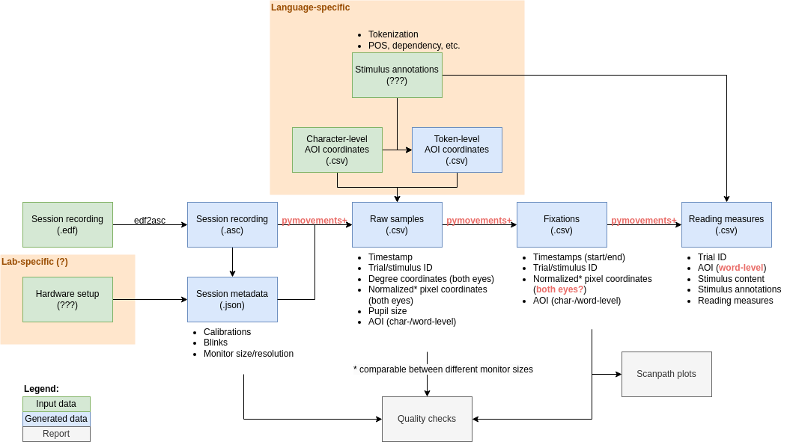

# multipleye-preprocessing

This is an inoffical, work-in-progress repo. Feel free to experiment and commit/push whatever you like. We will later put it to a proper clean repo. 

## Goals

- Preprocess data on session level
- Keep intermediate results between steps
- Keep preprocessing steps modular, allow manual intervention between steps
- Make pipeline self-contained and reproducible
- Support only EyeLink (for now)

## Preprocessing steps



All input and output files (except for the original EDF/ASC files) are to be included in the published dataset.

### 1. Conversion to sample-level CSV files

**Input:**
- EDF/ASC files (for EyeLink)  
  Use the following command to generate the ASC file:  
  ```bash
  $ ./edf2asc in.edf -input -ftime
  ```

**Output:**
- Sample-level CSV file for each trial
  - File name: `{participant-id}_{stimulus-id}-samples.csv`
  - Columns: `screen`, `time`, `pixel_x`, `pixel_y`, `pupil`
- Session-level metadata
  - File name: `session-metadata.json` (?)
  - Content: calibrations, which eye for which trial, ...

### 2. Fixation and saccade detection, AOI mapping

**Input:**
- `{participant-id}_{stimulus-id}-samples.csv`
- Character-level AOI definitions
  - File name: `aoi-char.csv` (?)
  - Columns: `id`, `stimulus_id`, `screen`, `top_left_x`, `top_left_y`, `width`, `height`, `text`
- Token-level AOI definitions
  - File name: `aoi-token.csv` (?)
  - Columns: `id`, `stimulus_id`, `screen`, `top_left_x`, `top_left_y`, `width`, `height`, `text`

**Output:**
- Fixation-level CSV file for each trial
  - File name: `{participant-id}_{stimulus-id}_fixations.csv`
  - Columns: `screen`, `onset`, `offset`, `pixel_x`, `pixel_y`, `char_aoi_id`, `token_aoi_id`
- Saccade-level CSV file for each trial
  - File name: `{participant-id}_{stimulus-id}_saccades.csv`
  - Columns: `screen`, `onset`, `offset`, `start_pixel_x`, `start_pixel_y`, `char_aoi_id`, `token_aoi_id`

### 3. Reading measures

**Input:**
- `{participant-id}_{stimulus-id}_fixations.csv`
  
**Output:**
- AOI-level CSV file containing reading measures
  - File name: `{participant-id}_{stimulus-id}_measures.csv`
  - Columns: `screen`, `token_aoi_id`, `tft`, `fpr`, ...

### 4. Quality checks

- All trials and screens present?
- Plausible reading times?
- Ratio of fixations on stimulus
- Blinks
- Optical artefact detection
- Data loss ratio
- Calibration quality
- Main sequence plots
- ...

## Missing features and blocking issues in `pymovements`

- [x] Float timestamps for 2000 Hz data (https://github.com/aeye-lab/pymovements/issues/688)
- [ ] Excessive memory usage when computing event properties (https://github.com/aeye-lab/pymovements/issues/753)
- [ ] Binocular ASC parsing (https://github.com/aeye-lab/pymovements/issues/686)
- [ ] Reading EDF directly (https://github.com/aeye-lab/pymovements/issues/509)
- [ ] Reading measures (https://github.com/aeye-lab/pymovements/issues/701, https://github.com/aeye-lab/pymovements/issues/33)

