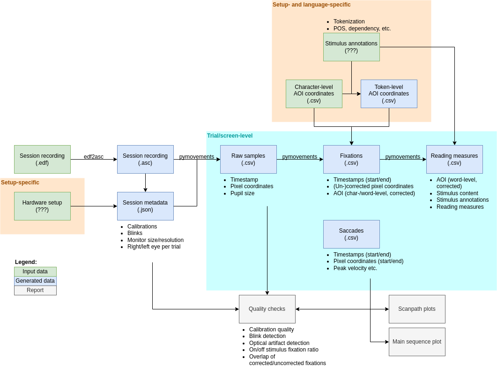

# multipleye-preprocessing

This is an inoffical, work-in-progress repo. Feel free to experiment and commit/push whatever you like. We will later put it to a proper clean repo. 

## Goals

- Preprocess data on session level
- Keep intermediate results between steps
- Keep preprocessing steps modular, allow manual intervention between steps
- Make pipeline self-contained and reproducible
- Support only EyeLink (for now)

## Data flow

## Roadmap

- [ ] Basic pipeline skeleton
  - [ ] Pipeline config
  - [ ] CLI
- [ ] Preprocessing steps
  - [ ] edf2asc
  - [ ] Raw sample extraction
    - [ ] Coordinate normalization
    - [ ] AOI mapping
  - [ ] Fixation detection
  - [ ] Reading measure calculation
- [ ] Quality checks
- [ ] Plots
- [ ] Documentation

## Missing features in `pymovements`

- [ ] Float timestamps for 2000 Hz data (https://github.com/aeye-lab/pymovements/issues/688)
- [ ] Binocular ASC parsing (https://github.com/aeye-lab/pymovements/issues/686)
- [ ] Reading measures (https://github.com/aeye-lab/pymovements/issues/701, https://github.com/aeye-lab/pymovements/issues/33)
- [ ] ASC parsing with any combination of -res/-vel/-input options (https://www.sr-research.com/support/thread-7675.html)
